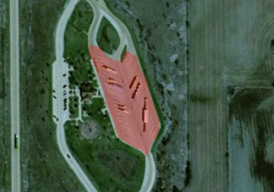

# ReadMe

This repository is based on a project conducted by Michael Fixl, Josef Hinterleitner, [Felix Krause](https://www.linkedin.com/in/felix-krause-7a643b222) und [Adrian Seiß](https://www.linkedin.com/in/adrian-sei%C3%9F) at the Vienna University of Economics and Business in collaboration with [Trustbit](trustbit.tech).

 
The notebooks cointained correspond to the following tasks:

0. Script to manually filter satellite images and labels based on a list of coordinates (GeoPandas)
1. Combine several white- and blacklists from manual filtering to one csv containing coordinates and an id
2. Create training data for object detection (XML file with pixel values of bounding box, not in this repo yet)
3. Create training data for polygonal labels
    1. Save information in one JSON (only necessary for image segmentation with e.g. Mask R-CNN, not in this repo yet)
    2. Save information as masks (necessary for algorithms of [Segmentation Models API](https://github.com/qubvel/segmentation_models))
4. Train image segmentation models (U-Net, Linknet, FPN and PSPNet) in a simple baseline setting
5. Training to fine-tune the best performing model of 4.

 

 

References:
- Coordinate data is from OpenStreetMap
- Satellite imagery is from the Esri satellite, [World Imagery](https://www.arcgis.com/home/item.html?id=10df2279f9684e4a9f6a7f08febac2a9#!)
- Parts from a Notebook from Dr. Vadim Savenkov
- Image segmentation training notebooks adapted from [Dr. Sreenivas Bhattiprolu](https://github.com/bnsreenu/python_for_microscopists/tree/master/228_semantic_segmentation_of_aerial_imagery_using_unet)
- Image segmentation models via [Segmentation Models API](https://github.com/qubvel/segmentation_models)

 

Please conform to the license applied.